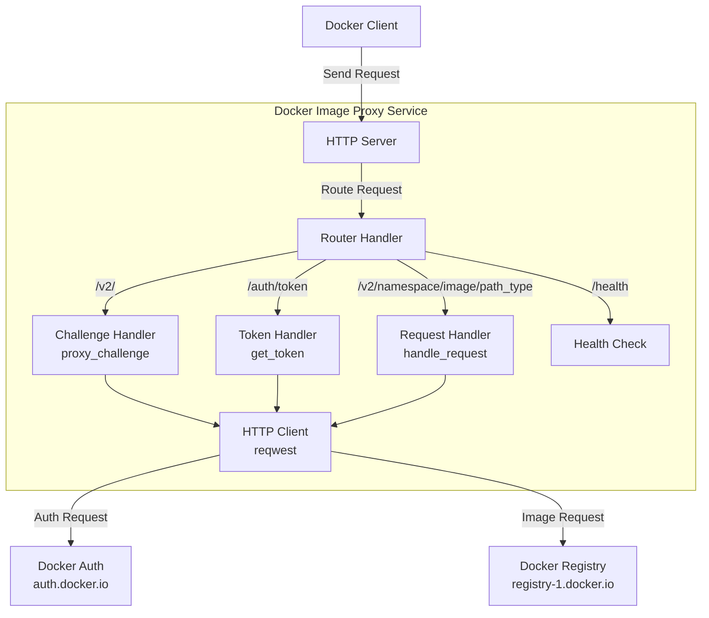
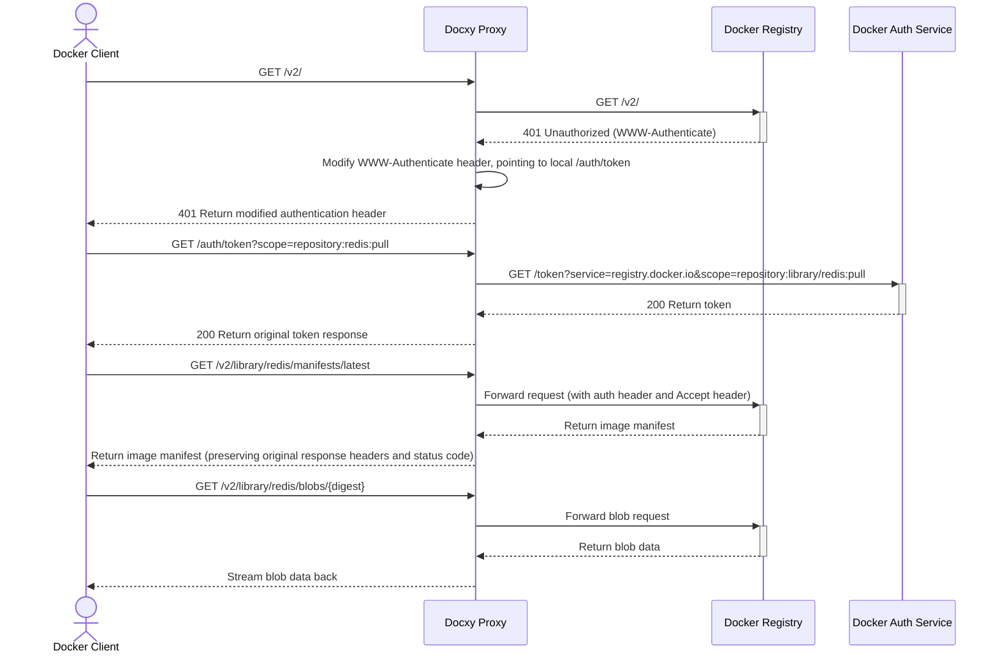
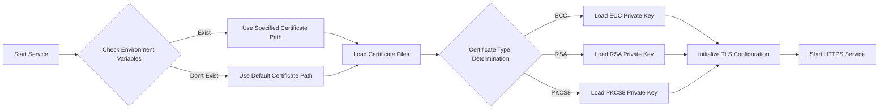

# Docxy

[](https://www.rust-lang.org)
[](https://www.docker.com)
[](https://github.com/harrisonwang/docxy/releases)
[](LICENSE)

<div align="center">
  <a href="./README.md"></a>
  <a href="./README_CN.md"></a>
  <a href="./README_RU.md"></a>
  <a href="./README_ES.md"></a>
  <a href="./README_KR.md"></a>
  <a href="./README_AR.md"></a>
  <a href="./README_TR.md"></a>
</div>

Lightweight Docker image proxy service that solves Docker Hub access restriction issues in certain regions.

## Background

### Introduction to Docker Image Repositories

Docker image repositories are services for storing and distributing Docker container images, providing centralized storage for containerized applications. These repositories allow developers to push, store, manage, and pull container images, simplifying the distribution and deployment process of applications.

### Types of Image Repositories

- **Official Image Repository**: Docker Hub, the official repository maintained by Docker Inc.
- **Third-party Independent Image Repositories**: Such as AWS ECR, Google GCR, Alibaba Cloud ACR, etc., used for publishing and sharing proprietary images
- **Image Acceleration Services**: Such as Tsinghua TUNA Mirror, Alibaba Cloud Image Accelerator, etc., which provide image acceleration services for Docker Hub

> [!NOTE]
> Due to network restrictions, direct access to Docker Hub is difficult in certain regions, and most image acceleration services have also been discontinued.

### Why Image Proxies are Needed

Image proxies are middleware services that connect Docker clients with Docker Hub. They don't store actual images but only forward requests, effectively solving:

- Network access restriction issues
- Improving image download speed

Docxy is such an image proxy service, aiming to bypass network blockages and accelerate image downloads through a self-hosted image proxy.

### Usage Limitations of Image Proxies

Docker Hub implements strict rate limiting policies for image pulls. When using proxy services, the following limitations exist:

- If not logged in, each IP address is limited to 10 image pulls per hour
- If logged in with a personal account, you can pull 100 images per hour
- For other account types, please refer to the table below:

| User Type                   | Pull Rate Limit       |
| --------------------------- | --------------------- |
| Business (authenticated)    | Unlimited             |
| Team (authenticated)        | Unlimited             |
| Pro (authenticated)         | Unlimited             |
| **Personal (authenticated)**| **100/hour/account**  |
| **Unauthenticated users**   | **10/hour/IP**        |

> [!WARNING]
> Note: This limitation will take effect from April 1, 2025

## Technical Principles

Docxy implements a complete Docker Registry API proxy, which only requires adding Docker client proxy configuration to use.

### System Architecture



### Request Flow



### Certificate Handling Process



## Features

- **Transparent Proxy**: Fully compatible with Docker Registry API v2
- **Seamless Integration**: Only requires configuring the mirror source, no change in usage habits
- **High-Performance Transfer**: Uses streaming processing for response data, supports large image downloads
- **TLS Encryption**: Built-in HTTPS support, ensuring secure data transmission
- **Accelerated Official Image Downloads**: Provides more stable connections
- **Bypassing Network Blockages**: Solves access restriction issues in certain regions

## Quick Start

> [!TIP]
> Before deployment, please resolve your domain to the target host in advance.

### One-Click Deployment

```bash
bash <(curl -Ls https://raw.githubusercontent.com/harrisonwang/docxy/main/install.sh)
```

> [!WARNING]
> Note: ZeroSSL certificate authority requires account registration before issuing certificates. For convenience, the script forces the use of Let's Encrypt as the certificate authority and forces certificate reissuance.

### Development

1. Clone the repository

   ```bash
   cd /opt
   git clone https://github.com/harrisonwang/docxy.git
   ```

2. Enter the project directory

   ```bash
   cd /opt/docxy
   ```

3. Configure certificates (using test.com domain as an example)

   ```bash
   export CERT_PATH=/root/.acme.sh/test.com_ecc/fullchain.cer
   export KEY_PATH=/root/.acme.sh/test.com_ecc/test.com.key
   ```

> [!TIP]
> Please apply for TLS certificates in advance using acme.sh

4. Start the service

   ```bash
   cargo run
   ```

5. Build the binary package

   ```bash
   cargo build --release
   ```

### Docker Client Configuration

Edit the `/etc/docker/daemon.json` configuration file and add the following proxy settings:

```json
{
  "registry-mirrors": ["https://test.com"]
}
```

### Health Check

You can check if the service is running properly by accessing the following endpoint:

```bash
curl https://test.com/health
```

## API Reference

| Endpoint | Method | Description |
|----------|--------|-------------|
| `/health` | GET | Health check interface |
| `/v2/` | GET | Docker Registry API v2 entry point and authentication challenge |
| `/auth/token` | GET | Authentication token acquisition interface |
| `/v2/{namespace}/{image}/{path_type}/{reference}` | GET/HEAD | Image resource access interface, supporting manifests and blobs, etc. |

## Other Solutions

- [Cloudflare Worker Implementation of Image Proxy](https://voxsay.com/posts/china-docker-registry-proxy-guide/): Use with caution, may lead to Cloudflare account suspension.
- [Nginx Implementation of Image Proxy](https://voxsay.com/posts/china-docker-registry-proxy-guide/): Only proxies registry-1.docker.io, but still has requests sent to auth.docker.io. Once auth.docker.io is also blocked, it will not function properly.

## License

This project is licensed under the MIT License - see the [LICENSE](LICENSE) file for details.
