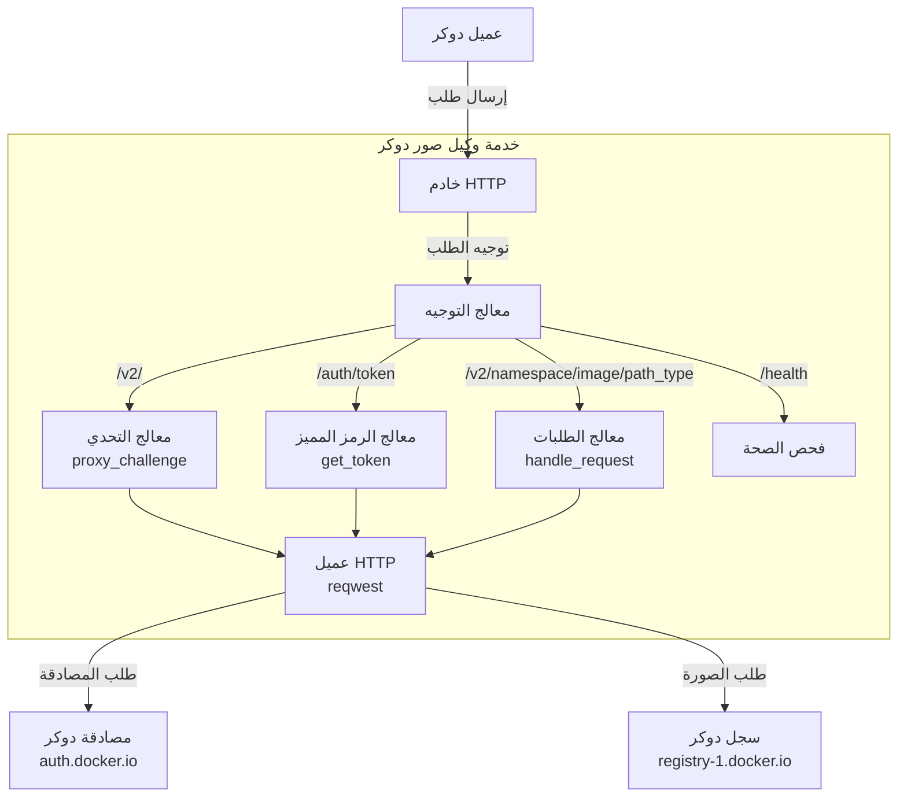
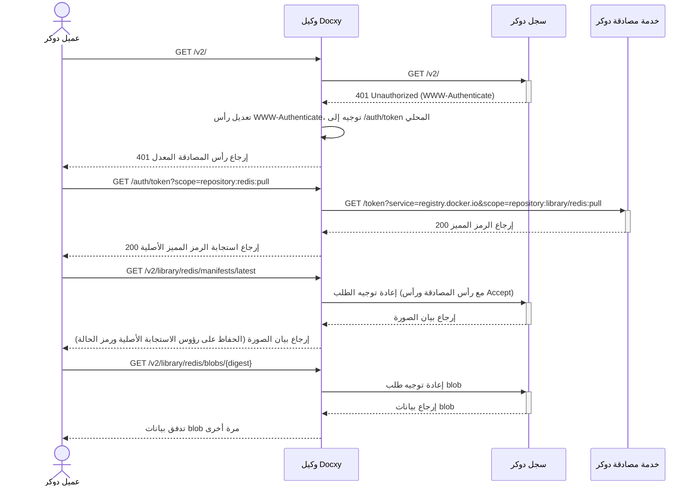
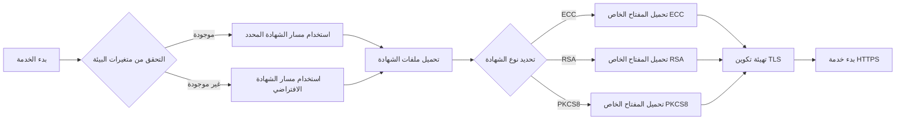

# Docxy

[](https://www.rust-lang.org)
[](https://www.docker.com)
[](https://github.com/harrisonwang/docxy/releases)
[](LICENSE)

<div align="center">
  <a href="./README.md"></a>
  <a href="./README_CN.md"></a>
  <a href="./README_RU.md"></a>
  <a href="./README_ES.md"></a>
  <a href="./README_KR.md"></a>
  <a href="./README_AR.md"></a>
  <a href="./README_TR.md"></a>
</div>

خدمة وكيل خفيفة لصور دوكر، تحل مشكلة الوصول المقيد إلى Docker Hub في مناطق معينة.

## الخلفية

### مقدمة لمستودعات صور دوكر

مستودعات صور دوكر هي خدمات لتخزين وتوزيع صور حاويات دوكر، توفر تخزينًا مركزيًا للتطبيقات المحوسبة. تسمح هذه المستودعات للمطورين بدفع وتخزين وإدارة وسحب صور الحاويات، مما يبسط عملية توزيع ونشر التطبيقات.

### أنواع مستودعات الصور

- **مستودع الصور الرسمي**: Docker Hub، المستودع الرسمي الذي تديره شركة دوكر
- **مستودعات الصور المستقلة من طرف ثالث**: مثل AWS ECR، Google GCR، Alibaba Cloud ACR، إلخ، المستخدمة لنشر ومشاركة الصور الخاصة
- **خدمات تسريع الصور**: مثل مرآة Tsinghua TUNA، ومسرع صور Alibaba Cloud، إلخ، التي توفر خدمات تسريع صور لـ Docker Hub

> [!NOTE]
> بسبب قيود الشبكة، يصعب الوصول المباشر إلى Docker Hub في بعض المناطق، كما تم إيقاف معظم خدمات تسريع الصور أيضًا.

### لماذا نحتاج إلى وكيل الصور

وكلاء الصور هي خدمات وسيطة تربط عملاء دوكر بـ Docker Hub. إنها لا تخزن الصور الفعلية، بل تعيد توجيه الطلبات فقط، مما يحل بفعالية:

- مشاكل قيود الوصول إلى الشبكة
- تحسين سرعة تنزيل الصور

Docxy هي خدمة وكيل صور تهدف إلى تجاوز حظر الشبكة وتسريع تنزيلات الصور من خلال وكيل ذاتي الاستضافة.

### قيود استخدام وكلاء الصور

يطبق Docker Hub سياسات صارمة لتحديد معدل سحب الصور. عند استخدام خدمات الوكيل، توجد القيود التالية:

- إذا لم تكن مسجلاً، فإن كل عنوان IP محدود بـ 10 سحب للصور في الساعة
- إذا كنت مسجلاً بحساب شخصي، يمكنك سحب 100 صورة في الساعة
- بالنسبة لأنواع الحسابات الأخرى، يرجى الرجوع إلى الجدول أدناه:

| نوع المستخدم                | حد معدل السحب            |
| --------------------------- | ------------------------ |
| Business (مصادق عليه)       | غير محدود                |
| Team (مصادق عليه)           | غير محدود                |
| Pro (مصادق عليه)            | غير محدود                |
| **Personal (مصادق عليه)**   | **100/ساعة/حساب**       |
| **المستخدمون غير المصادق عليهم** | **10/ساعة/IP**          |

> [!WARNING]
> ملاحظة: سيدخل هذا القيد حيز التنفيذ اعتبارًا من 1 أبريل 2025

## المبادئ التقنية

تنفذ Docxy وكيلًا كاملًا لـ Docker Registry API، والذي يتطلب فقط إضافة تكوين وكيل عميل دوكر للاستخدام.

### هيكل النظام



### تدفق الطلب



### عملية معالجة الشهادات



## الميزات

- **وكيل شفاف**: متوافق تمامًا مع Docker Registry API v2
- **تكامل سلس**: يتطلب فقط تكوين مصدر الصورة، دون تغيير عادات الاستخدام
- **نقل عالي الأداء**: يستخدم معالجة البث للبيانات المستجابة، يدعم تنزيل الصور الكبيرة
- **تشفير TLS**: دعم HTTPS مدمج، يضمن نقل البيانات الآمن
- **تسريع تنزيل الصور الرسمية**: يوفر اتصالات أكثر استقرارًا
- **تجاوز حظر الشبكة**: يحل مشاكل تقييد الوصول في مناطق معينة

## البدء السريع

> [!TIP]
> قبل النشر، يرجى حل اسم المجال إلى المضيف الهدف مسبقًا.

### نشر بنقرة واحدة

```bash
bash <(curl -Ls https://raw.githubusercontent.com/harrisonwang/docxy/main/install.sh)
```

> [!WARNING]
> ملاحظة: تتطلب هيئة إصدار شهادات ZeroSSL تسجيل حساب قبل إصدار الشهادات. لسهولة الاستخدام، يفرض البرنامج النصي استخدام Let's Encrypt كهيئة إصدار شهادات ويفرض إعادة إصدار الشهادة.

### التطوير

1. استنساخ المستودع

   ```bash
   cd /opt
   git clone https://github.com/harrisonwang/docxy.git
   ```

2. الدخول إلى دليل المشروع

   ```bash
   cd /opt/docxy
   ```

3. تكوين الشهادات (باستخدام اسم المجال test.com كمثال)

   ```bash
   export CERT_PATH=/root/.acme.sh/test.com_ecc/fullchain.cer
   export KEY_PATH=/root/.acme.sh/test.com_ecc/test.com.key
   ```

> [!TIP]
> يرجى التقدم بطلب للحصول على شهادات TLS مسبقًا باستخدام acme.sh

4. بدء الخدمة

   ```bash
   cargo run
   ```

5. بناء الحزمة الثنائية

   ```bash
   cargo build --release
   ```

### تكوين عميل دوكر

قم بتحرير ملف التكوين `/etc/docker/daemon.json` وأضف إعدادات الوكيل التالية:

```json
{
  "registry-mirrors": ["https://test.com"]
}
```

### فحص الصحة

يمكنك التحقق مما إذا كانت الخدمة تعمل بشكل صحيح من خلال الوصول إلى نقطة النهاية التالية:

```bash
curl https://test.com/health
```

## مرجع API

| نقطة النهاية | الطريقة | الوصف |
|--------------|---------|-------|
| `/health` | GET | واجهة فحص الصحة |
| `/v2/` | GET | نقطة دخول Docker Registry API v2 وتحدي المصادقة |
| `/auth/token` | GET | واجهة الحصول على رمز المصادقة |
| `/v2/{namespace}/{image}/{path_type}/{reference}` | GET/HEAD | واجهة الوصول إلى موارد الصورة، تدعم manifests وblobs وغيرها |

## حلول أخرى

- [تنفيذ وكيل الصور باستخدام Cloudflare Worker](https://voxsay.com/posts/china-docker-registry-proxy-guide/): استخدم بحذر، قد يؤدي إلى تعليق حساب Cloudflare.
- [تنفيذ وكيل الصور باستخدام Nginx](https://voxsay.com/posts/china-docker-registry-proxy-guide/): يقوم بعمل وكيل لـ registry-1.docker.io فقط، ولكن لا يزال هناك طلبات مرسلة إلى auth.docker.io. بمجرد حظر auth.docker.io أيضًا، لن يعمل بشكل صحيح.

## الترخيص

هذا المشروع مرخص بموجب ترخيص MIT - انظر ملف [LICENSE](LICENSE) لمزيد من التفاصيل.
