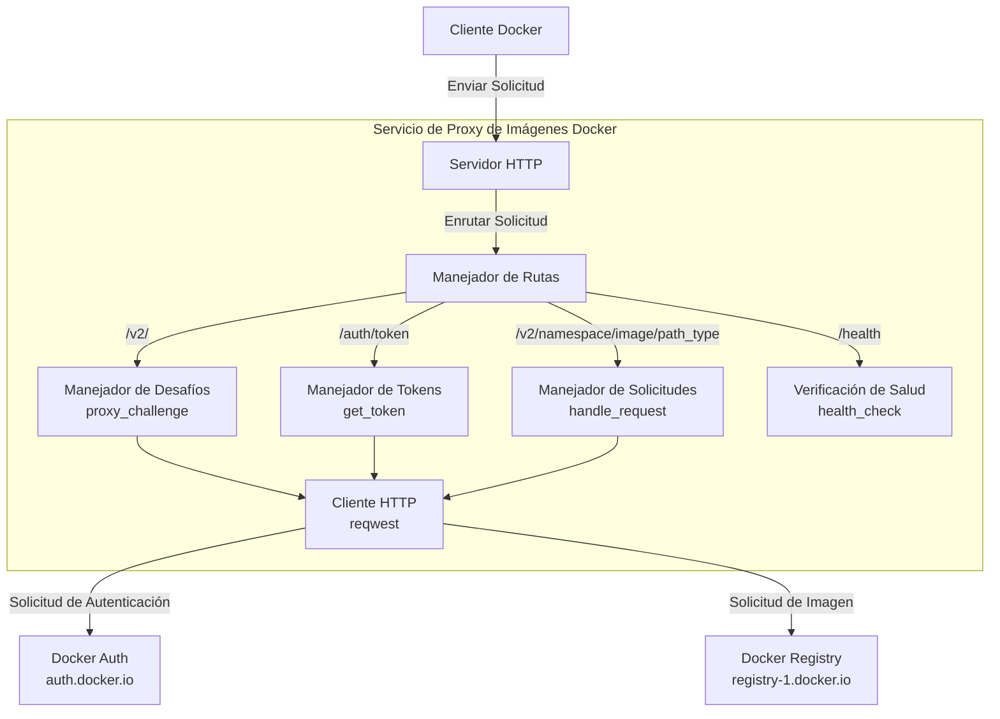
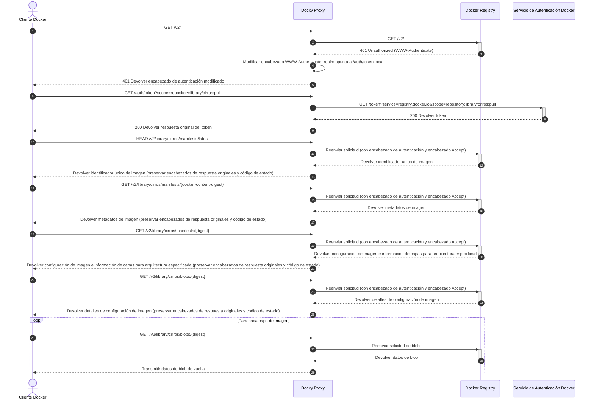
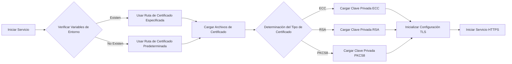

# Docxy

[](README_EN.md)
[](README.md)
[](README_RU.md)
[](README_ES.md)
[](README_KR.md)
[](README_AR.md)
[](README_TR.md)
[](https://www.rust-lang.org)
[](https://www.docker.com)

Servicio ligero de proxy de imágenes Docker que resuelve problemas de acceso restringido a Docker Hub en ciertas regiones.

## Antecedentes

### Introducción a los Repositorios de Imágenes Docker

Los repositorios de imágenes Docker son servicios para almacenar y distribuir imágenes de contenedores Docker, proporcionando almacenamiento centralizado para aplicaciones containerizadas. Estos repositorios permiten a los desarrolladores enviar, almacenar, gestionar y descargar imágenes de contenedores, simplificando el proceso de distribución e implementación de aplicaciones.

### Tipos de Repositorios de Imágenes

- **Repositorio Oficial de Imágenes**: Docker Hub, el repositorio oficial mantenido por Docker Inc.
- **Repositorios Independientes de Terceros**: Como AWS ECR, Google GCR, Alibaba Cloud ACR, etc., utilizados para publicar y compartir imágenes propias
- **Servicios de Aceleración de Imágenes**: Como el espejo Tsinghua TUNA, el acelerador de imágenes de Alibaba Cloud, etc., que proporcionan servicios de aceleración de imágenes para Docker Hub

> [!NOTE]
> Debido a restricciones de red, el acceso directo a Docker Hub es difícil en algunas regiones, y la mayoría de los servicios de aceleración de imágenes también han sido discontinuados.

### Por qué se Necesitan Proxies de Imágenes

Los proxies de imágenes son servicios intermedios que conectan los clientes Docker con Docker Hub. No almacenan imágenes reales, solo reenvían solicitudes, resolviendo eficazmente:

- Problemas de restricciones de acceso a la red
- Mejora de la velocidad de descarga de imágenes

Docxy es un servicio de proxy de imágenes que tiene como objetivo eludir los bloqueos de red y acelerar las descargas de imágenes a través de un proxy autohospedado.

### Limitaciones de Uso de los Proxies de Imágenes

Docker Hub implementa políticas estrictas de limitación de velocidad para la descarga de imágenes. Al utilizar servicios de proxy, existen las siguientes limitaciones:

- Si no estás autenticado, cada dirección IP está limitada a 10 descargas de imágenes por hora
- Si estás autenticado con una cuenta personal, puedes descargar 100 imágenes por hora
- Para otros tipos de cuentas, consulta la siguiente tabla:

| Tipo de Usuario              | Límite de Velocidad de Descarga |
| ---------------------------- | ------------------------------- |
| Business (autenticado)       | Sin límite                      |
| Team (autenticado)           | Sin límite                      |
| Pro (autenticado)            | Sin límite                      |
| **Personal (autenticado)**   | **100/hora/cuenta**             |
| **Usuarios no autenticados** | **10/hora/IP**                  |

## Principios Técnicos

Docxy implementa un proxy completo de la API de Docker Registry, que solo requiere agregar la configuración del proxy del cliente Docker para su uso.

### Arquitectura del Sistema



### Flujo de Solicitudes



### Proceso de Manejo de Certificados



## Características

- **Proxy Transparente**: Totalmente compatible con Docker Registry API v2
- **Integración Perfecta**: Solo requiere configurar la fuente de imagen, sin cambiar hábitos de uso
- **Transferencia de Alto Rendimiento**: Utiliza procesamiento de streaming para datos de respuesta, soporta descargas de imágenes grandes
- **Encriptación TLS**: Soporte HTTPS integrado, garantizando transferencia segura de datos
- **Descargas Aceleradas de Imágenes Oficiales**: Proporciona conexiones más estables
- **Evasión de Bloqueos de Red**: Resuelve problemas de restricción de acceso en ciertas regiones

## Inicio Rápido

> [!TIP]
> Antes del despliegue, por favor resuelve tu dominio al host objetivo con anticipación.

### Despliegue con Un Clic

```bash
bash <(curl -Ls https://raw.githubusercontent.com/harrisonwang/docxy/main/install.sh)
```

> [!WARNING]
> Nota: La autoridad de certificación ZeroSSL requiere registro de cuenta antes de emitir certificados. Para mayor comodidad, el script fuerza el uso de Let's Encrypt como autoridad de certificación y fuerza la reemisión del certificado.

### Desarrollo

1. Clonar el repositorio

   ```bash
   cd /opt
   git clone https://github.com/harrisonwang/docxy.git
   ```

2. Entrar al directorio del proyecto

   ```bash
   cd /opt/docxy
   ```

3. Configurar certificados (usando el dominio test.com como ejemplo)

   ```bash
   export DOCXY_CERT_PATH=/root/.acme.sh/test.com_ecc/fullchain.cer
   export DOCXY_KEY_PATH=/root/.acme.sh/test.com_ecc/test.com.key
   ```

> [!TIP]
> Por favor solicita certificados TLS con anticipación usando acme.sh

4. Iniciar el servicio

   ```bash
   cargo run
   ```

5. Construir el paquete binario

   ```bash
   cargo build --release
   ```

### Uso del Cliente Docker

#### Uso Predeterminado

1. Edita el archivo de configuración `/etc/docker/daemon.json` y agrega la siguiente configuración de proxy:

```json
{
  "registry-mirrors": ["https://test.com"]
}
```

2. Ejecuta el comando `docker pull hello-world` para descargar imágenes

#### Uso con Inicio de Sesión

1. Usa `docker login test.com` para iniciar sesión en tu repositorio de imágenes Docker
2. Edita manualmente el archivo `~/.docker/config.json` y agrega el siguiente contenido:
```diff
{
	"auths": {
		"test.com": {
			"auth": "<nombre de usuario:contraseña o Token codificado en base64>"
-		}
+		},
+		"https://index.docker.io/v1/": {
+			"auth": "<igual que el anterior>"
+		}
+	}
}
```

> [!TIP]
> En Windows 11, el archivo está ubicado en `%USERPROFILE%\.docker\config.json`

3. Ejecuta el comando `docker pull hello-world` para descargar imágenes con autenticación, aumentando así los límites de descarga

### Verificación de Salud

Puedes verificar si el servicio está funcionando correctamente accediendo al siguiente endpoint:

```bash
curl https://test.com/health
```

## Referencia de API

| Endpoint | Método | Descripción |
|----------|--------|-------------|
| `/health` | GET | Interfaz de verificación de salud |
| `/v2/` | GET | Punto de entrada de Docker Registry API v2 y desafío de autenticación |
| `/auth/token` | GET | Interfaz de obtención de token de autenticación |
| `/v2/{namespace}/{image}/{path_type}/{reference}` | GET/HEAD | Interfaz de acceso a recursos de imagen, soportando manifests y blobs, etc. |

## Otras Soluciones

- [Implementación de Proxy de Imágenes con Cloudflare Worker](https://voxsay.com/posts/china-docker-registry-proxy-guide/): Usar con precaución, puede llevar a la suspensión de la cuenta de Cloudflare.
- [Implementación de Proxy de Imágenes con Nginx](https://voxsay.com/posts/china-docker-registry-proxy-guide/): Solo hace proxy a registry-1.docker.io, pero aún tiene solicitudes enviadas a auth.docker.io. Una vez que auth.docker.io también sea bloqueado, no funcionará correctamente.

## Licencia

Este proyecto está licenciado bajo la Licencia MIT - ver el archivo [LICENSE](LICENSE) para más detalles.
