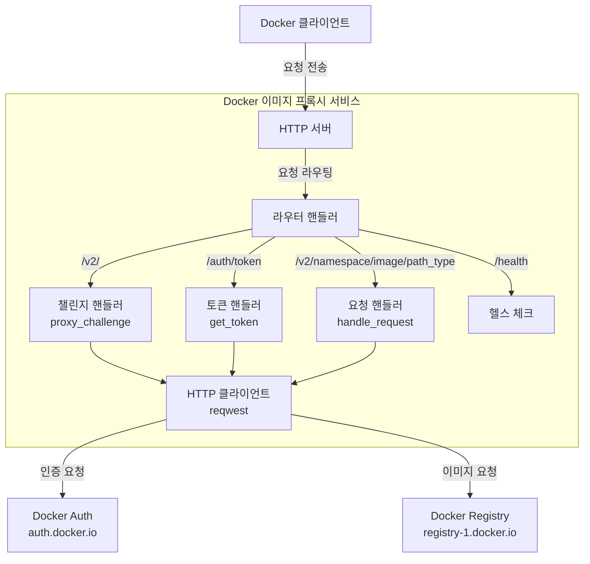
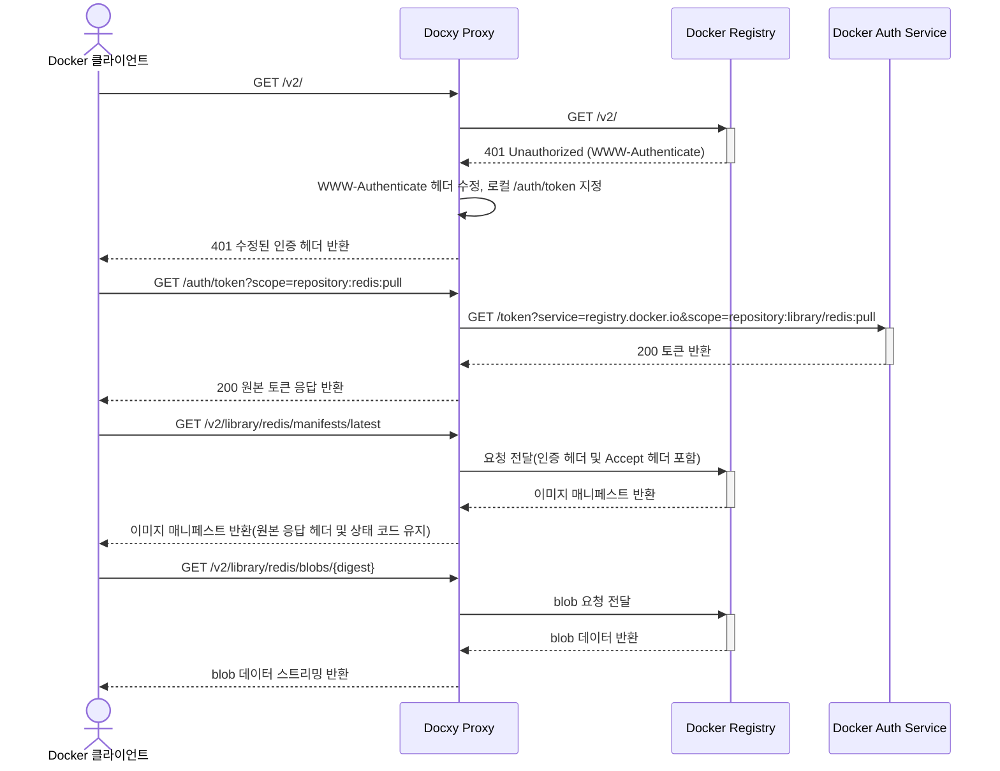
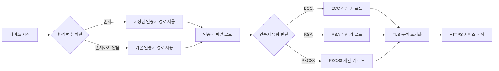

# Docxy

[](https://www.rust-lang.org)
[](https://www.docker.com)
[](https://github.com/harrisonwang/docxy/releases)
[](LICENSE)

<div align="center">
  <a href="./README.md"></a>
  <a href="./README_CN.md"></a>
  <a href="./README_RU.md"></a>
  <a href="./README_ES.md"></a>
  <a href="./README_KR.md"></a>
  <a href="./README_AR.md"></a>
  <a href="./README_TR.md"></a>
</div>

경량 Docker 이미지 프록시 서비스로, 특정 지역에서 Docker Hub 접근 제한 문제를 해결합니다.

## 배경

### Docker 이미지 저장소 소개

Docker 이미지 저장소는 Docker 컨테이너 이미지를 저장하고 배포하는 서비스로, 컨테이너화된 애플리케이션에 중앙 집중식 저장소를 제공합니다. 이러한 저장소는 개발자가 컨테이너 이미지를 푸시, 저장, 관리 및 가져오기 할 수 있게 하여 애플리케이션의 배포 및 배치 과정을 단순화합니다.

### 이미지 저장소 유형

- **공식 이미지 저장소**: Docker Hub, Docker 회사에서 유지 관리하는 공식 저장소
- **써드파티 독립 이미지 저장소**: AWS ECR, Google GCR, Alibaba Cloud ACR 등과 같이 자체 이미지를 발행하고 공유하는 데 사용됨
- **이미지 가속 서비스**: Tsinghua TUNA 미러, Alibaba Cloud 이미지 가속기 등과 같이 Docker Hub의 이미지 가속 서비스를 제공

> [!NOTE]
> 네트워크 제한 영향으로 일부 지역에서는 Docker Hub에 직접 접근하기 어렵고, 대부분의 이미지 가속 서비스도 이미 중단되었습니다.

### 이미지 프록시가 필요한 이유

이미지 프록시는 Docker 클라이언트와 Docker Hub를 연결하는 중간 계층 서비스로, 실제 이미지를 저장하지 않고 요청만 전달하여 다음 문제를 효과적으로 해결합니다:

- 네트워크 접근 제한 문제
- 이미지 다운로드 속도 향상

Docxy는 이러한 이미지 프록시 서비스로, 자체 구축 이미지 프록시를 통해 네트워크 차단을 우회하고 이미지 다운로드 속도를 가속화하는 것을 목표로 합니다.

### 이미지 프록시 사용 제한

Docker Hub는 이미지 가져오기에 대해 엄격한 속도 제한 정책을 시행하며, 프록시 서비스 사용 시 다음과 같은 제한이 있습니다:

- 로그인하지 않은 경우, 각 IP 주소당 시간당 이미지 10회만 가져올 수 있습니다
- 개인 계정으로 로그인한 경우, 시간당 이미지 100회를 가져올 수 있습니다
- 다른 유형의 계정에 대한 구체적인 제한은 아래 표를 참조하세요:

| 사용자 유형                 | pull 속도 제한      |
| --------------------------- | ------------------- |
| Business (인증됨)           | 제한 없음           |
| Team (인증됨)               | 제한 없음           |
| Pro (인증됨)                | 제한 없음           |
| **Personal (인증됨)**       | **100/시간/계정**   |
| **인증되지 않은 사용자**    | **10/시간/IP**      |

> [!WARNING]
> 참고: 이 제한은 2025년 4월 1일부터 적용됩니다

## 기술 원리

Docxy는 완전한 Docker Registry API 프록시를 구현하며, Docker 클라이언트 프록시 구성만 추가하면 사용할 수 있습니다.

### 시스템 아키텍처



### 요청 흐름



### 인증서 처리 과정



## 기능 특징

- **투명한 프록시**: Docker Registry API v2와 완벽하게 호환
- **원활한 통합**: 이미지 소스 구성만 필요하며, 사용 습관 변경 불필요
- **고성능 전송**: 응답 데이터 스트리밍 처리, 대형 이미지 다운로드 지원
- **TLS 암호화**: 내장 HTTPS 지원, 데이터 전송 보안 보장
- **공식 이미지 다운로드 가속**: 더 안정적인 연결 제공
- **네트워크 차단 우회**: 특정 지역의 접근 제한 문제 해결

## 빠른 시작

> [!TIP]
> 배포 시작 전, 도메인을 대상 호스트에 미리 연결하세요.

### 원클릭 배포

```bash
bash <(curl -Ls https://raw.githubusercontent.com/harrisonwang/docxy/main/install.sh)
```

> [!WARNING]
> 참고: ZeroSSL 인증 기관은 인증서 발급 전 계정 등록이 필요합니다. 사용 편의성을 위해 스크립트는 Let's Encrypt를 인증 기관으로 강제 사용하며, 인증서를 강제로 재발급합니다.

### 개발

1. 저장소 클론

   ```bash
   cd /opt
   git clone https://github.com/harrisonwang/docxy.git
   ```

2. 프로젝트 디렉토리 진입

   ```bash
   cd /opt/docxy
   ```

3. 인증서 구성(test.com 도메인 예시)

   ```bash
   export CERT_PATH=/root/.acme.sh/test.com_ecc/fullchain.cer
   export KEY_PATH=/root/.acme.sh/test.com_ecc/test.com.key
   ```

> [!TIP]
> acme.sh를 사용하여 미리 TLS 인증서를 발급받으세요

4. 서비스 시작

   ```bash
   cargo run
   ```

5. 바이너리 패키지 빌드

   ```bash
   cargo build --release
   ```

### Docker 클라이언트 구성

`/etc/docker/daemon.json` 구성 파일을 편집하고 다음 프록시 설정을 추가하세요:

```json
{
  "registry-mirrors": ["https://test.com"]
}
```

### 헬스 체크

다음 엔드포인트에 접근하여 서비스가 정상적으로 실행 중인지 확인할 수 있습니다:

```bash
curl https://test.com/health
```

## API 참조

| 엔드포인트 | 메소드 | 설명 |
|------------|--------|------|
| `/health` | GET | 헬스 체크 인터페이스 |
| `/v2/` | GET | Docker Registry API v2 엔트리 포인트 및 인증 챌린지 |
| `/auth/token` | GET | 인증 토큰 획득 인터페이스 |
| `/v2/{namespace}/{image}/{path_type}/{reference}` | GET/HEAD | 이미지 리소스 접근 인터페이스, manifests 및 blobs 등 지원 |

## 다른 방안

- [Cloudflare Worker를 이용한 이미지 프록시 구현](https://voxsay.com/posts/china-docker-registry-proxy-guide/): 주의해서 사용하세요, Cloudflare 계정 정지 가능성이 있습니다.
- [Nginx를 이용한 이미지 프록시 구현](https://voxsay.com/posts/china-docker-registry-proxy-guide/): registry-1.docker.io만 프록시하며, auth.docker.io로 보내는 요청이 여전히 존재합니다. auth.docker.io도 차단되면 정상적으로 사용할 수 없게 됩니다.

## 라이선스

이 프로젝트는 MIT 라이선스를 따릅니다. 자세한 내용은 [LICENSE](LICENSE) 파일을 참조하세요.
