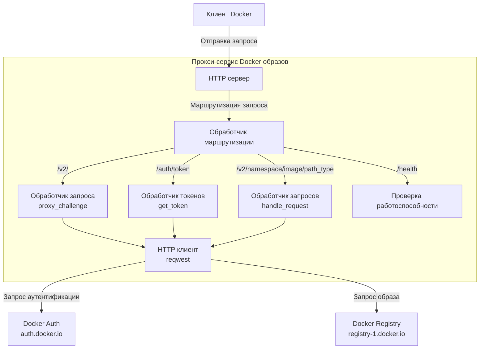
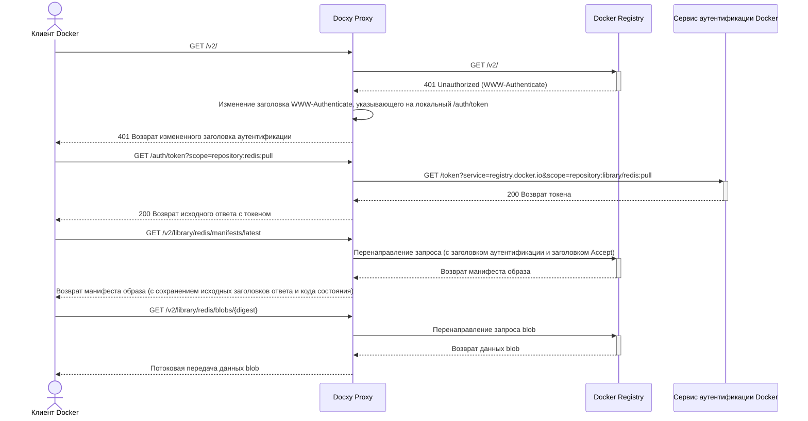
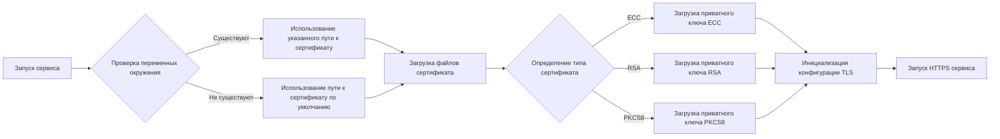

# Docxy

[](README.md)
[](README_CN.md)
[](README_RU.md)
[](README_ES.md)
[](README_KR.md)
[](README_AR.md)
[](README_TR.md)
[](https://www.rust-lang.org)
[](https://www.docker.com)

Легковесный прокси-сервис Docker образов, решающий проблему ограниченного доступа к Docker Hub.

## Предыстория

### Введение в репозитории Docker образов

Репозитории Docker образов - это сервисы для хранения и распространения образов Docker контейнеров, обеспечивающие централизованное хранение для контейнеризированных приложений. Эти репозитории позволяют разработчикам отправлять, хранить, управлять и загружать образы контейнеров, упрощая процесс распространения и развертывания приложений.

### Типы репозиториев образов

- **Официальный репозиторий образов**: Docker Hub, официальный репозиторий, поддерживаемый компанией Docker
- **Независимые сторонние репозитории образов**: Такие как AWS ECR, Google GCR, Alibaba Cloud ACR и т.д., используемые для публикации и совместного использования собственных образов
- **Сервисы ускорения образов**: Например, зеркало Tsinghua TUNA, ускоритель образов Alibaba Cloud и т.д., предоставляющие услуги ускорения образов для Docker Hub

> [!NOTE]
> Из-за сетевых ограничений, прямой доступ к Docker Hub затруднен в некоторых регионах, а большинство сервисов ускорения образов также прекратили свою работу.

### Зачем нужны прокси для образов

Прокси для образов - это промежуточные сервисы, соединяющие клиенты Docker с Docker Hub. Они не хранят сами образы, а только перенаправляют запросы, эффективно решая:

- Проблемы с ограничением доступа к сети
- Увеличение скорости загрузки образов

Docxy - это такой прокси-сервис для образов, нацеленный на обход сетевых блокировок и ускорение загрузки образов через самостоятельно размещенный прокси.

### Ограничения использования прокси для образов

Docker Hub применяет строгие политики ограничения скорости для загрузки образов. При использовании прокси-сервисов существуют следующие ограничения:

- Если вы не вошли в систему, каждый IP-адрес ограничен 10 загрузками образов в час
- Если вы вошли с личной учетной записью, вы можете загружать 100 образов в час
- Для других типов учетных записей, смотрите таблицу ниже:

| Тип пользователя             | Ограничение скорости загрузки |
| ---------------------------- | ----------------------------- |
| Business (аутентифицированный)     | Без ограничений               |
| Team (аутентифицированный)         | Без ограничений               |
| Pro (аутентифицированный)          | Без ограничений               |
| **Personal (аутентифицированный)** | **100/час/аккаунт**           |
| **Неаутентифицированные пользователи**    | **10/час/IP**                 |

> [!WARNING]
> Примечание: Это ограничение вступит в силу с 1 апреля 2025 года

## Технические принципы

Docxy реализует полный прокси для Docker Registry API, который требует только добавления настройки прокси клиента Docker для использования.

### Системная архитектура



### Процесс запроса



### Процесс обработки сертификата



## Функциональные особенности

- **Прозрачный прокси**: Полностью совместим с Docker Registry API v2
- **Бесшовная интеграция**: Требуется только настройка источника образа, без изменения привычек использования
- **Высокопроизводительная передача**: Использует потоковую обработку данных ответа, поддерживает загрузку больших образов
- **TLS шифрование**: Встроенная поддержка HTTPS, обеспечивающая безопасную передачу данных
- **Ускоренная загрузка официальных образов**: Обеспечивает более стабильное соединение
- **Обход сетевых блокировок**: Решает проблемы с ограничением доступа в определенных регионах

## Быстрый старт

> [!TIP]
> Перед началом развертывания, пожалуйста, заранее разрешите домен на целевой хост.

### Развертывание в один клик

```bash
bash <(curl -Ls https://raw.githubusercontent.com/harrisonwang/docxy/main/install.sh)
```

> [!WARNING]
> Примечание: Центр сертификации ZeroSSL требует регистрации учетной записи перед выдачей сертификатов. Для удобства использования скрипт принудительно использует Let's Encrypt в качестве центра сертификации и принудительно перевыпускает сертификат.

### Разработка

1. Клонирование репозитория

   ```bash
   cd /opt
   git clone https://github.com/harrisonwang/docxy.git
   ```

2. Перейдите в директорию проекта

   ```bash
   cd /opt/docxy
   ```

3. Настройка сертификатов (на примере домена test.com)

   ```bash
   export DOCXY_CERT_PATH=/root/.acme.sh/test.com_ecc/fullchain.cer
   export DOCXY_KEY_PATH=/root/.acme.sh/test.com_ecc/test.com.key
   ```

> [!TIP]
> Пожалуйста, заранее подайте заявку на TLS сертификаты с помощью acme.sh

4. Запуск сервиса

   ```bash
   cargo run
   ```

5. Сборка бинарного пакета

   ```bash
   cargo build --release
   ```

### Настройка клиента Docker

Отредактируйте файл конфигурации `/etc/docker/daemon.json`, добавив следующие настройки прокси:

```json
{
  "registry-mirrors": ["https://test.com"]
}
```

### Проверка работоспособности

Вы можете проверить, правильно ли работает сервис, обратившись к следующей конечной точке:

```bash
curl https://test.com/health
```

## Справочник по API

| Конечная точка | Метод | Описание |
|----------------|-------|----------|
| `/health` | GET | Интерфейс проверки работоспособности |
| `/v2/` | GET | Точка входа Docker Registry API v2 и запрос аутентификации |
| `/auth/token` | GET | Интерфейс получения токена аутентификации |
| `/v2/{namespace}/{image}/{path_type}/{reference}` | GET/HEAD | Интерфейс доступа к ресурсам образа, поддерживающий манифесты и блобы и т.д. |

## Другие решения

- [Реализация прокси образов с помощью Cloudflare Worker](https://voxsay.com/posts/china-docker-registry-proxy-guide/): Используйте с осторожностью, может привести к приостановке учетной записи Cloudflare.
- [Реализация прокси образов с помощью Nginx](https://voxsay.com/posts/china-docker-registry-proxy-guide/): Только проксирует registry-1.docker.io, но по-прежнему имеет запросы, отправляемые на auth.docker.io. Как только auth.docker.io также будет заблокирован, он не будет работать должным образом.

## Лицензия

Этот проект лицензирован под лицензией MIT - см. файл [LICENSE](LICENSE) для получения подробной информации.
