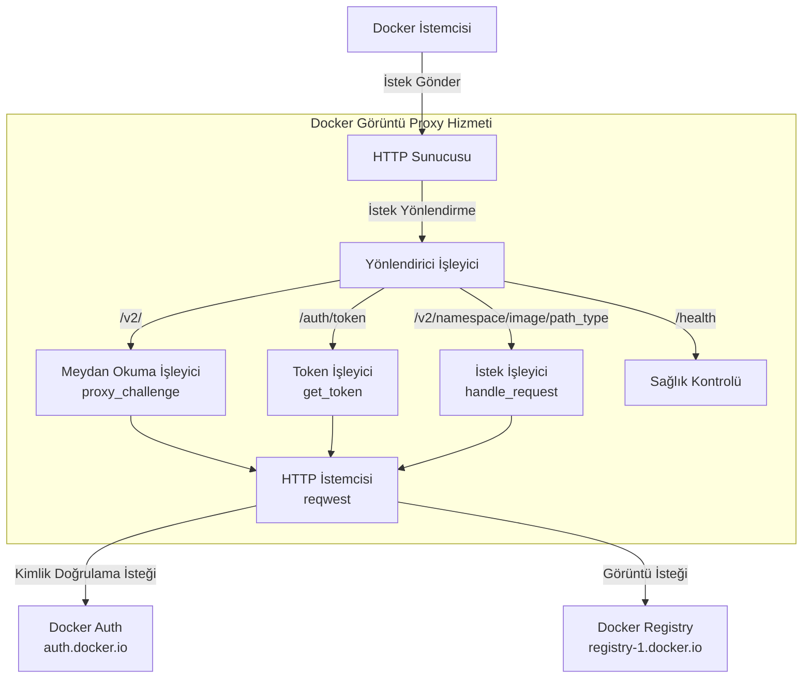
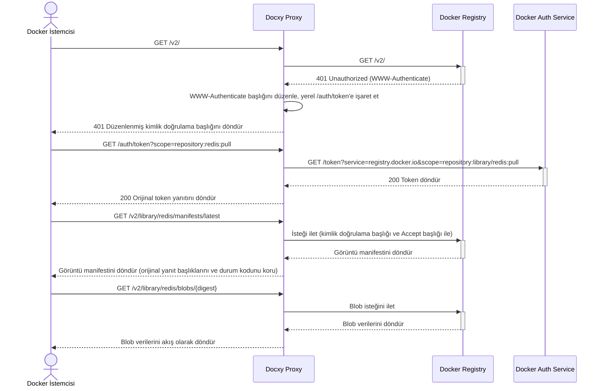
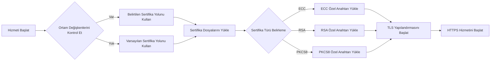

# Docxy

[](https://www.rust-lang.org)
[](https://www.docker.com)
[](https://github.com/harrisonwang/docxy/releases)
[](LICENSE)

<div align="center">
  <a href="./README.md"></a>
  <a href="./README_CN.md"></a>
  <a href="./README_RU.md"></a>
  <a href="./README_ES.md"></a>
  <a href="./README_KR.md"></a>
  <a href="./README_AR.md"></a>
  <a href="./README_TR.md"></a>
</div>

Belirli bölgelerde Docker Hub erişim kısıtlaması sorununu çözen hafif Docker görüntü proxy hizmeti.

## Arka Plan

### Docker Görüntü Depoları Hakkında

Docker görüntü depoları, Docker konteyner görüntülerini depolayan ve dağıtan hizmetlerdir ve konteynerleştirilmiş uygulamalar için merkezi depolama sağlarlar. Bu depolar, geliştiricilerin konteyner görüntülerini itmesine, depolamasına, yönetmesine ve çekmesine olanak tanıyarak uygulamaların dağıtım ve konuşlandırma sürecini basitleştirir.

### Görüntü Depo Türleri

- **Resmi Görüntü Deposu**: Docker Hub, Docker şirketi tarafından yönetilen resmi depo
- **Üçüncü Taraf Bağımsız Görüntü Depoları**: AWS ECR, Google GCR, Alibaba Cloud ACR vb. gibi kendi görüntülerini yayımlamak ve paylaşmak için kullanılanlar
- **Görüntü Hızlandırma Hizmetleri**: Tsinghua TUNA mirror, Alibaba Cloud görüntü hızlandırıcı vb. gibi Docker Hub için görüntü hızlandırma hizmetleri sunanlar

> [!NOTE]
> Ağ kısıtlamaları nedeniyle bazı bölgelerde Docker Hub'a doğrudan erişim zordur ve çoğu görüntü hızlandırma hizmeti de hizmet vermeyi durdurmuştur.

### Neden Görüntü Proxy'sine İhtiyaç Var

Görüntü proxy'leri, Docker istemcileri ile Docker Hub arasında bağlantı kuran ara katman hizmetleridir. Gerçek görüntüleri depolamazlar, sadece istekleri iletirler ve şu sorunları etkili bir şekilde çözerler:

- Ağ erişim kısıtlaması sorunları
- Görüntü indirme hızının artırılması

Docxy böyle bir görüntü proxy hizmetidir ve amacı, kendi kendine barındırılan bir görüntü proxy'si aracılığıyla ağ engellemelerini aşmak ve görüntü indirme hızını artırmaktır.

### Görüntü Proxy'si Kullanım Sınırlamaları

Docker Hub, görüntü çekme işlemleri için katı hız sınırlama politikaları uygular. Proxy hizmetleri kullanırken aşağıdaki sınırlamalar vardır:

- Oturum açılmamışsa, her IP adresi saatte yalnızca 10 görüntü çekebilir
- Kişisel bir hesapla oturum açılmışsa, saatte 100 görüntü çekebilirsiniz
- Diğer hesap türleri için belirli sınırlamalar için aşağıdaki tabloya bakın:

| Kullanıcı Türü                | Pull Hız Sınırı       |
| ----------------------------- | --------------------- |
| Business (kimliği doğrulanmış) | Sınırsız              |
| Team (kimliği doğrulanmış)     | Sınırsız              |
| Pro (kimliği doğrulanmış)      | Sınırsız              |
| **Personal (kimliği doğrulanmış)** | **100/saat/hesap** |
| **Kimliği doğrulanmamış kullanıcılar** | **10/saat/IP**     |

> [!WARNING]
> Not: Bu sınırlama 1 Nisan 2025 tarihinden itibaren geçerli olacaktır

## Teknik İlkeler

Docxy, eksiksiz bir Docker Registry API proxy'si uygular ve kullanmak için sadece Docker istemci proxy yapılandırması eklemeniz gerekir.

### Sistem Mimarisi



### İstek Akışı



### Sertifika İşleme Süreci



## Özellikler

- **Şeffaf Proxy**: Docker Registry API v2 ile tamamen uyumlu
- **Sorunsuz Entegrasyon**: Sadece görüntü kaynağı yapılandırması gerektirir, kullanım alışkanlıklarını değiştirmek gerekmez
- **Yüksek Performanslı Aktarım**: Yanıt verilerini akış işleme kullanır, büyük görüntü indirmelerini destekler
- **TLS Şifreleme**: Yerleşik HTTPS desteği, güvenli veri iletimini sağlar
- **Resmi Görüntü İndirme Hızlandırma**: Daha kararlı bağlantılar sağlar
- **Ağ Engellemelerini Aşma**: Belirli bölgelerdeki erişim kısıtlaması sorunlarını çözer

## Hızlı Başlangıç

> [!TIP]
> Dağıtıma başlamadan önce, lütfen alan adınızı hedef makineye önceden çözümleyin.

### Tek Tıkla Dağıtım

```bash
bash <(curl -Ls https://raw.githubusercontent.com/harrisonwang/docxy/main/install.sh)
```

> [!WARNING]
> Not: ZeroSSL sertifika yetkilisi, sertifika vermeden önce hesap kaydı gerektirir. Kullanım kolaylığı için, betik Let's Encrypt'i sertifika yetkilisi olarak zorlar ve sertifikayı zorla yeniden düzenler.

### Geliştirme

1. Depoyu klonlayın

   ```bash
   cd /opt
   git clone https://github.com/harrisonwang/docxy.git
   ```

2. Proje dizinine girin

   ```bash
   cd /opt/docxy
   ```

3. Sertifikaları yapılandırın (test.com alan adı örneği)

   ```bash
   export DOCXY_CERT_PATH=/root/.acme.sh/test.com_ecc/fullchain.cer
   export DOCXY_KEY_PATH=/root/.acme.sh/test.com_ecc/test.com.key
   ```

> [!TIP]
> Lütfen acme.sh kullanarak TLS sertifikalarını önceden edinin

4. Hizmeti başlatın

   ```bash
   cargo run
   ```

5. İkili paket oluşturun

   ```bash
   cargo build --release
   ```

### Docker İstemci Yapılandırması

`/etc/docker/daemon.json` yapılandırma dosyasını düzenleyin ve aşağıdaki proxy ayarlarını ekleyin:

```json
{
  "registry-mirrors": ["https://test.com"]
}
```

### Sağlık Kontrolü

Aşağıdaki uç noktaya erişerek hizmetin düzgün çalışıp çalışmadığını kontrol edebilirsiniz:

```bash
curl https://test.com/health
```

## API Referansı

| Uç Nokta | Metod | Açıklama |
|----------|-------|----------|
| `/health` | GET | Sağlık kontrolü arayüzü |
| `/v2/` | GET | Docker Registry API v2 giriş noktası ve kimlik doğrulama meydan okuması |
| `/auth/token` | GET | Kimlik doğrulama token'i alma arayüzü |
| `/v2/{namespace}/{image}/{path_type}/{reference}` | GET/HEAD | Görüntü kaynağı erişim arayüzü, manifests ve blobs vb. destekler |

## Diğer Çözümler

- [Cloudflare Worker ile Görüntü Proxy'si Uygulaması](https://voxsay.com/posts/china-docker-registry-proxy-guide/): Dikkatli kullanın, Cloudflare hesabının askıya alınmasına neden olabilir.
- [Nginx ile Görüntü Proxy'si Uygulaması](https://voxsay.com/posts/china-docker-registry-proxy-guide/): Sadece registry-1.docker.io için proxy yapar, ancak hala auth.docker.io'ya gönderilen istekler vardır. auth.docker.io da engellenirse, düzgün çalışmayacaktır.

## Lisans

Bu proje MIT Lisansı altında lisanslanmıştır - detaylar için [LICENSE](LICENSE) dosyasına bakın.
